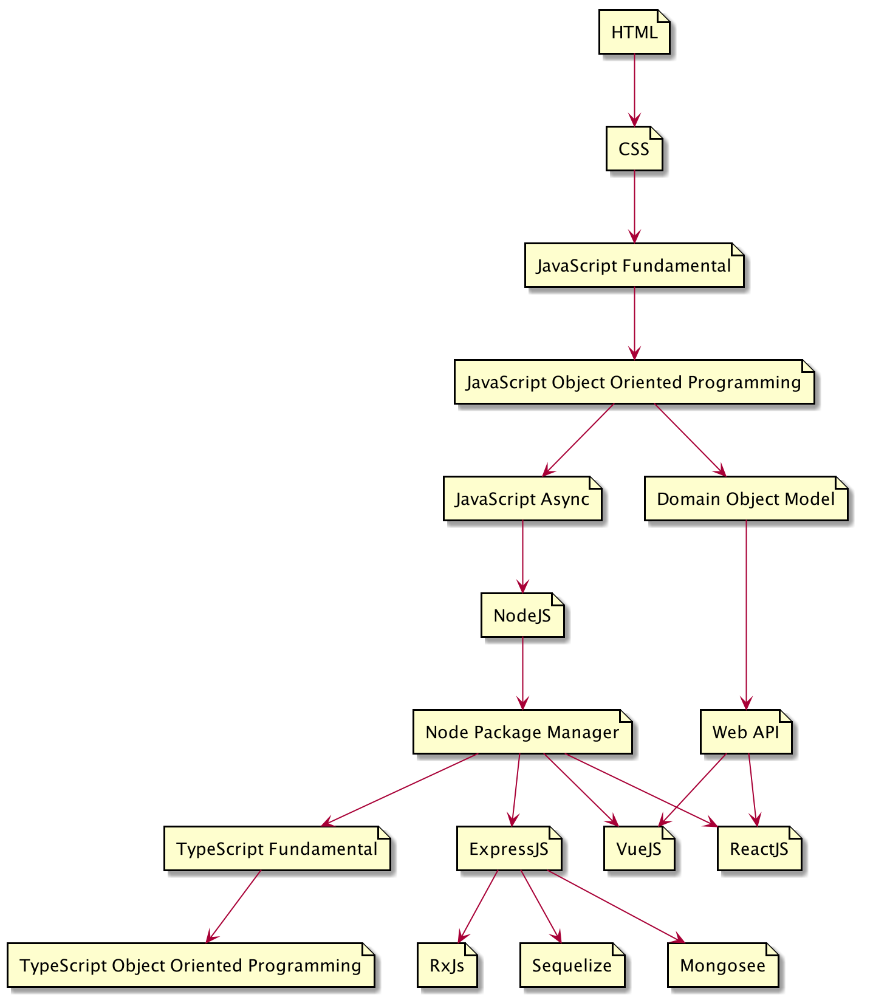

# Buku JavaScript

## Web
- HTML
- CSS

## Javascript
- JavaScript Fundamental
- JavaScript OOP
- JavaScript Async
- Domain Object Model

## Web API
- Canvas API
- Web Workers API
- Geolocation API
- IndexedDB API
- Web Storage API

## NodeJs
- NodeJS
- Node Package Manager

## Framework
- RxJS

## Database 
- Sequelize
- Mongosee

## TypeScript
- TypeScript Fundamental
- TypeScript OOP

## Backend Framework
- ExpressJS

## Frontend
- VueJS
